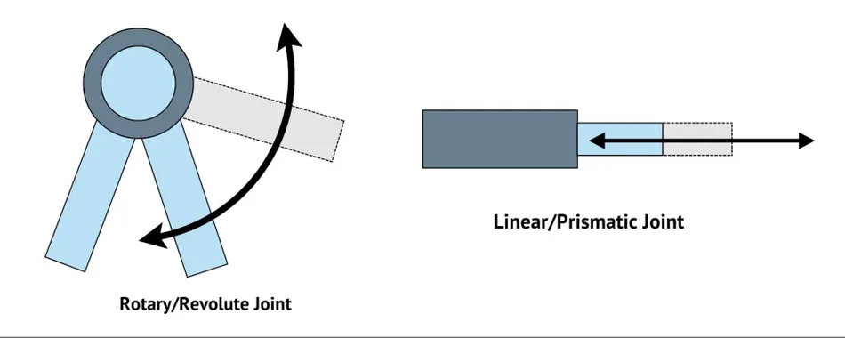
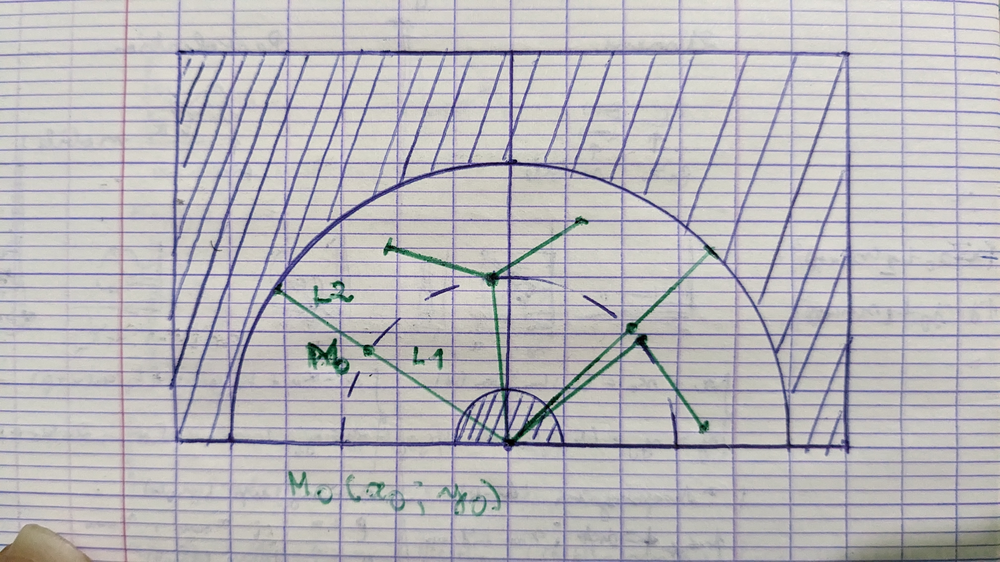

# PROJECT: ROBOT ARM KINEMATICS

## OBJECTIVE
This project implements a 2-link revolute robot arm in Python, including functionalities for moving joints and calculating the end-effector position. The core functionality is solving the inverse kinematics problem, which involves finding the joint angles required to reach a desired gripper position (and it was incredibly challenging, but fun).

## ROBOT ARM JOINTS
There are mainly two types of joint implemented in this project: the linear joints and the revolute joint.

### 1- The linear joint:
The linear joint is simply made of two "links", one fixed, and the other one which can move in or out of the first one. To implement the ``linear_joint`` class, I've considered two links, the fixed one (with fixed lenght) and the moveable one (variable lenght). By using simple trigonemetry, we can calculate the ``end_point_coordinates``:  ``x = x0 + link_lenght*cos(angle)`` and ``y = y0 + link_lenght*sin(self.angle)``.

Now, to move the joint, I first created the ``move`` method to allow the moveable link to go in and out by increasing or decreasing the lenght of the moveable joint by a certain distance. Then, to be able to move to any given coordinates, the ``move_to`` method comes in. It calculates the lenght the moveable link need to have for the given coordinates: ``new_link_lenght = sqrt(((x - x0)**2) + ((y - y0)**2))``. Fianlly, if the result isn't negative, it uses the ``move`` method to make the link move.

    PS: Actually, I didn't use the linear joint in this project because of its lack of mobility.

## 2- The revolute joint:
The revolute joint is also made of two links (fixed and moveable), but instead of going in or out, the moveable link rotate around the connection point (the joint). The implementation of ths one is a little bit tricky. This time, I will consider just one link, which can rotate around its first point. So the position of the ``end_foint_coordinates`` is given by the same formula: ``x = x0 + link_lenght*cos(angle)`` and ``y = y0 + link_lenght*sin(self.angle)``.

The ``rotate`` method makes vary the angle by increasing or decreasing it. And for the ``move_to`` method, I had to solve a system of two equations (the two position formulas) to get the expression of the angle in function of the given coordinates: ``new_angle =  atan2(yn - y_center, xn - x_center)``. So I just need to call the ``rotate`` method and here we go.

    PS: I've used the ``atan2(x,y)``  because, unlike ``atan(x,y)``, the signs of both x and y are considered. Don't ask me why it's like that, I don't know either.

## ROBOT ARM WITH TWO REVOLUTION JOINTS
Here comes the almighthy warrior: inverse kinenatics! Some might be thinking: "But it's not difficult. You just have two consider the two angles, do trigo stuff and it's done. It's easy to find it on the internet". Well, it might be true. The problem is that... I didn't use trigonometry. Let's take a look!

Let's consider that drawing above. The area the robot arm can reach is hatched. For simpicity, we will not take into account negative y-coordinates.

If we want the grip to reach a particular point in that domain, we have to check first if the coordinates of that point is on the cercle created by the second joint (L2), which equation is ``(x-x0)**2 + (y-y0)**2 = L2**2``. If it is, we just move the arm with the ``move_to()`` method.

If it is not, it means we have to move the first joint (L1), so that the second one can reach the desired coordinates. In order to do so, the ``end_point_coordinates`` of the first joint have to be a solution of this equations system:

    x0**2 + y0**2 = L1**2

    (x-x0)**2 + (y-y0)**2 = L2**2

The resolution of that system is a little bit tough, so I won't give more details for now.

## FINAL THOUGHTS

This project took a lot of time, more than I expected to take, but finishing it was so satisfying! It helps me improve my skills in calculus, kinematics, problem-solving and patience. 